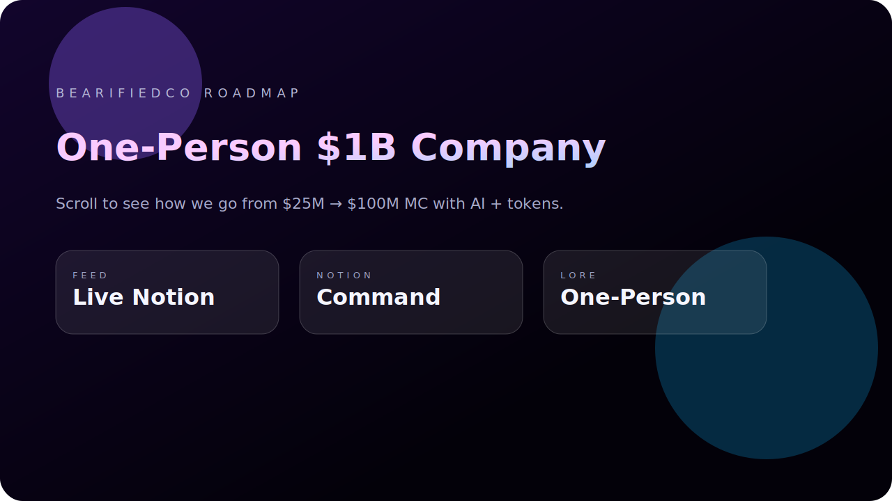
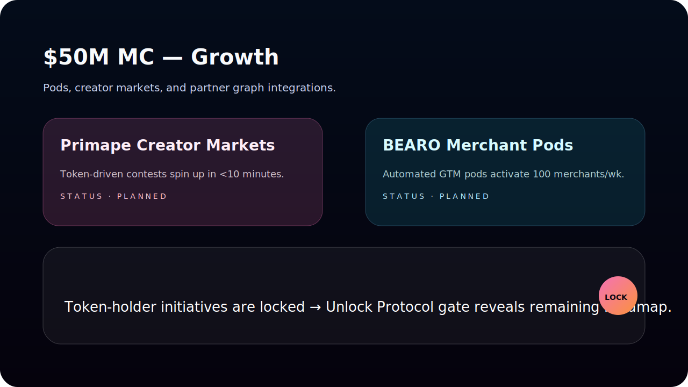

# Step 6 — Roadmap Microsite (Codex)

## Tech Stack
- **Framework:** Next.js 16 (App Router, Tailwind v4 inline directives)
- **Language:** TypeScript + modern CSS gradients / layout primitives
- **Data:** Live fetch via `@notionhq/client` + fallback data module
- **Animation:** GSAP + ScrollTrigger (parallax bubbles, card reveals, scroll progress)
- **Token gating:** Optional Unlock Protocol paywall script wrapped in a reusable `TokenGate` component

## Integration & Setup
1. `cd roadmap-microsite && npm install`
2. Copy `.env.example` → `.env.local` and populate:
   - `NOTION_TOKEN` — integration secret with access to the *Product Roadmap* database.
   - `NOTION_ROADMAP_DATABASE_ID` — database ID (share it with the integration inside Notion).
   - `NOTION_ROADMAP_PAGE_URL` — public “BearifiedCo Command Center” URL for CTA linking.
   - Optional Unlock values: `NEXT_PUBLIC_UNLOCK_ENABLED=true`, `NEXT_PUBLIC_UNLOCK_LOCK_ADDRESS`, `NEXT_PUBLIC_UNLOCK_NETWORK` (chain id), or paste full JSON in `NEXT_PUBLIC_UNLOCK_PAYWALL_CONFIG`.
3. `npm run dev` for local preview. The hero shows data source + last updated timestamp coming from the Notion feed (falls back to the bundled mock).
4. Production build: `npm run lint && npm run build && npm run start`. (Note: Next.js warns about multiple lockfiles in this mono-repo; safe to ignore or set `turbopack.root` later.)
5. Deployment: push branch `step6-roadmap-codex` and create PR titled **“Step 6 — Roadmap Microsite (Agent: Codex GPT-5)”**. Any static host (Vercel, Netlify) works — app is a standard Next build with an `/api/roadmap` route for future polling.

## Screens / Previews
- Hero layer: 
- Milestone & lock state: 

(Assets live under `roadmap-microsite/public/previews` for use in decks or README badges.)

## Deployment Readiness Checklist
- [x] `npm run lint` — passes (checked locally).
- [x] `npm run build` — passes (Next.js warning only about multiple lockfiles).
- [x] `.env.example` documents all required secrets.
- [x] `/api/roadmap` returns live Notion JSON (falls back if token/db missing).
- [x] Unlock gating scaffolded: preview stays public, gated cards hidden until wallet unlock.
- [x] Docs + previews added; hero references PDF narrative via `/docs/vision-narrative.pdf` copy bundled for hosting.
- [ ] Share the Notion database with the provided integration before deploying (current token lacks access — see console warning during fetch).

